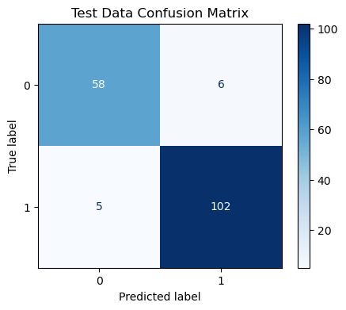
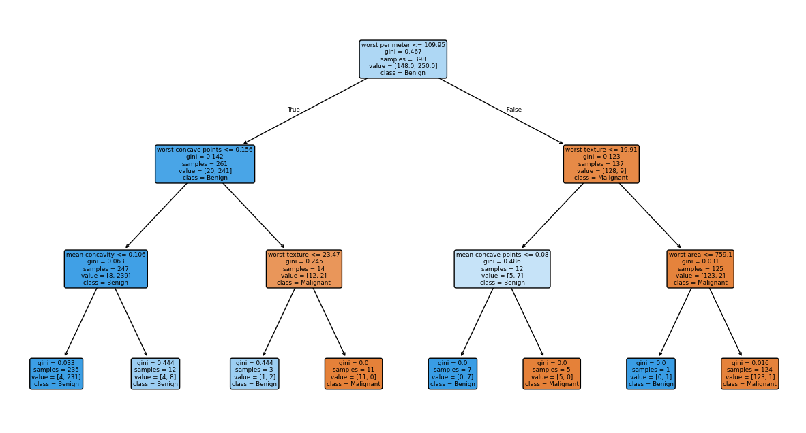

# Decision Trees on the Breast Cancer Dataset

## Overview

This project demonstrates the use of a **Decision Tree Classifier** for predicting whether a breast tumor is **malignant** or **benign** using the Breast Cancer Wisconsin dataset available in Scikit-Learn.

The objective is to build a classification model, evaluate its performance using standard classification metrics, and visualize the learned decision tree to understand how decisions are made.

---

## Dataset

**Source:** Scikit-Learn Breast Cancer Dataset

### Target Variable

| Value | Meaning |
|---------|---------|
| 0 | Malignant |
| 1 | Benign |

### Dataset Characteristics

- 569 patient records
- 30 numeric medical features
- Binary classification problem

Examples of features include:

- Mean Radius
- Mean Texture
- Mean Area
- Worst Perimeter
- Worst Texture
- Concavity Measures

---

## Project Workflow

### 1. Load Dataset

The Breast Cancer dataset is loaded directly from Scikit-Learn.

```python
from sklearn.datasets import load_breast_cancer
```

---

### 2. Train-Test Split

The dataset is divided into:

- 70% Training Data
- 30% Testing Data

Additional settings:

```python
random_state = 9001
stratify = y
```

Stratification ensures that the class distribution remains consistent across both training and testing datasets.

---

### 3. Build Decision Tree

A Decision Tree Classifier is created with:

```python
DecisionTreeClassifier(
    max_depth=3,
    random_state=9001
)
```

### Why max_depth = 3?

Limiting tree depth helps:

- Reduce overfitting
- Improve generalization
- Keep the tree interpretable

---

### 4. Train Model

```python
dt_classifier.fit(X_train, y_train)
```

During training, the algorithm:

- Calculates impurity (Gini)
- Searches for optimal splits
- Creates branches recursively
- Builds the decision tree

---

### 5. Generate Predictions

```python
y_test_pred = dt_classifier.predict(X_test)
```

Each patient record traverses the tree from the root node to a leaf node, where the final prediction is produced.

---

### 6. Evaluate Model

The following metrics are generated:

- Accuracy
- Confusion Matrix
- Precision
- Recall
- F1 Score

---

## Results

### Test Accuracy

```text
93.57%
```

---

### Confusion Matrix

```text
[[58  6]
 [ 5 102]]
```

Interpretation:

| Actual | Predicted | Count |
|----------|----------|---------|
| Malignant | Malignant | 58 |
| Malignant | Benign | 6 |
| Benign | Malignant | 5 |
| Benign | Benign | 102 |

---

### Classification Report

```text
              precision    recall    f1-score

Malignant        0.92       0.91       0.91
Benign           0.94       0.95       0.95

Accuracy                               0.94
```

---

## Root Node Analysis

The first split selected by the Decision Tree was:

```text
worst perimeter <= 109.95
```

This indicates that **Worst Perimeter** was the most informative feature for reducing impurity and separating malignant from benign tumors.

---

## Decision Tree Visualization

### Confusion Matrix



Example:

```text
images/confusion_matrix.png
```

---

### Decision Tree Structure



Example:

```text
images/decision_tree.png
```

---

## Key Learnings

This project demonstrates several important Decision Tree concepts:

- Classification using Decision Trees
- Gini Impurity based splitting
- Root Nodes, Decision Nodes, and Leaf Nodes
- Controlling overfitting using `max_depth`
- Model evaluation using Confusion Matrix and Classification Report
- Model interpretability through tree visualization

---

## Technologies Used

- Python
- NumPy
- Pandas
- Matplotlib
- Scikit-Learn

---

## Files Included

```text
Decision_Trees_Breast_Cancer.ipynb
README.md
```

---

## Conclusion

A Decision Tree Classifier with a maximum depth of 3 achieved **93.57% accuracy** on the Breast Cancer dataset while remaining highly interpretable. The model identified **Worst Perimeter** as the most important initial splitting feature and successfully demonstrated how tree-based algorithms can be used for medical classification problems.