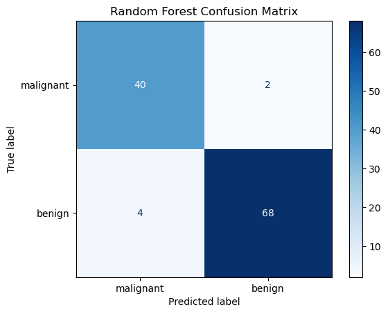
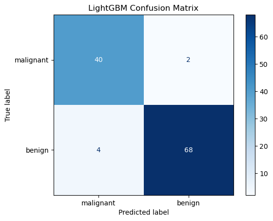

# Breast Cancer Classification using Random Forest and LightGBM

## Overview

This graded assessment is part of the **Foundations of Machine Learning (C4M5 - Ensembles)** module of the Master's in Machine Learning and AI program.

The objective of this notebook is to compare two powerful ensemble learning techniques:

1. **Random Forest (Bagging-based Ensemble)**
2. **LightGBM (Boosting-based Ensemble)**

Both models are trained on the Breast Cancer dataset from Scikit-Learn to predict whether a tumor is:

- **0 → Malignant**
- **1 → Benign**

The notebook evaluates both models using classification metrics and compares their predictive performance.

---

## Dataset

The dataset used is the built-in **Breast Cancer Wisconsin Dataset** from Scikit-Learn.

### Dataset Summary

| Property | Value |
|---------|------:|
| Total Samples | 569 |
| Features | 30 |
| Classes | 2 |
| Target Variable | Breast Cancer Diagnosis |

### Target Classes

| Label | Meaning |
|------:|----------|
| 0 | Malignant |
| 1 | Benign |

---

## Train-Test Split

The dataset is split as follows:

- Training Data → **80%**
- Testing Data → **20%**
- `random_state = 9001`
- `stratify = y`

Stratification ensures that the class distribution remains similar in both the training and testing datasets.

---

# Model 1 – Random Forest

Random Forest is a **Bagging-based Ensemble Learning** algorithm.

It works by:

1. Creating multiple bootstrap samples from the dataset.
2. Training many Decision Trees independently.
3. Using majority voting to produce the final prediction.

### Hyperparameters Used

| Parameter | Value |
|----------|------:|
| class_weight | balanced |
| random_state | 9001 |
| n_estimators | 100 |
| max_depth | 4 |

---

## Random Forest Results

### Confusion Matrix

### Classification Report

| Metric | Value |
|------|------:|
| Accuracy | 94.74% |
| Precision (Malignant) | 90.91% |
| Recall (Malignant) | 95.24% |
| F1 Score | 93.02% |
| ROC AUC | **0.9861** |

### Interpretation

- The model correctly identified **40 malignant tumors**.
- It incorrectly classified **2 malignant tumors as benign**.
- ROC AUC of **0.9861** indicates excellent class separation capability.
- The model demonstrates high recall, which is particularly important in medical diagnosis where missing cancer cases can be costly.

---

# Model 2 – LightGBM

LightGBM is a **Gradient Boosting** framework developed by Microsoft.

Unlike Random Forest, which trains trees independently, LightGBM:

1. Builds trees sequentially.
2. Each tree learns from the mistakes of previous trees.
3. Optimizes the model by minimizing prediction errors iteratively.

---

### Hyperparameters Used

| Parameter | Value |
|----------|------:|
| class_weight | balanced |
| random_state | 9001 |
| verbose | -1 |
| n_estimators | 100 |
| max_depth | 2 |
| learning_rate | 0.1 |

---

## LightGBM Results

### Confusion Matrix

### Classification Report

| Metric | Value |
|------|------:|
| Accuracy | 94.74% |
| Precision (Malignant) | 90.91% |
| Recall (Malignant) | 95.24% |
| F1 Score | 93.02% |
| ROC AUC | **0.9838** |

### Interpretation

- LightGBM produced the same confusion matrix and classification report as Random Forest.
- The ROC AUC score is marginally lower than Random Forest.
- This indicates that both models classified patients similarly, but Random Forest produced slightly better probability estimates.

---

# Random Forest vs LightGBM

| Metric | Random Forest | LightGBM |
|------|------:|------:|
| Accuracy | 94.74% | 94.74% |
| Precision | 90.91% | 90.91% |
| Recall | 95.24% | 95.24% |
| F1 Score | 93.02% | 93.02% |
| ROC AUC | **0.9861** | 0.9838 |

---

## Key Learnings

This assessment demonstrates two major ensemble learning paradigms:

### Bagging

- Multiple independent trees
- Trained on bootstrap samples
- Predictions combined by voting
- Reduces variance
- Example: Random Forest

### Boosting

- Trees trained sequentially
- Each tree corrects previous mistakes
- Optimizes prediction error iteratively
- Reduces bias and improves accuracy
- Example: LightGBM

---

## Conclusion

Both Random Forest and LightGBM achieved strong performance on the Breast Cancer dataset.

- Random Forest achieved a slightly higher ROC AUC score.
- Both models achieved identical accuracy and classification metrics.
- The results highlight the effectiveness of Ensemble Learning techniques in solving real-world medical classification problems.

This assignment provides a practical comparison of **Bagging vs Boosting**, two of the most important concepts in modern Machine Learning.