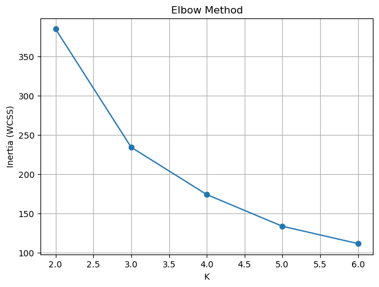
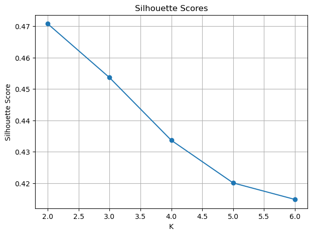

# K-Means Clustering

## Overview

This project is part of the **Foundations of Machine Learning (C4M6)** module from the Master's in Machine Learning and AI program.

The objective of this assignment is to apply **K-Means Clustering** on a car dataset and identify natural groups of cars based on their characteristics.

The clustering is performed on the following features:

- Engine Size
- Horsepower
- City MPG
- Highway MPG

Since clustering is an **Unsupervised Learning** technique, there is **no target variable**.

---

## Dataset

| Property | Value |
|---------|------:|
| Total Samples | 205 |
| Total Features | 4 |
| Target Variable | None |
| Learning Type | Unsupervised |

### Features Used

| Feature | Description |
|------|------|
| enginesize | Engine size of the car |
| horsepower | Engine horsepower |
| citympg | Mileage in city driving |
| highwaympg | Mileage in highway driving |

---

## Feature Scaling

Before applying K-Means, the features were standardized using:

```python
StandardScaler()
```

This is important because K-Means uses **Euclidean Distance**, which is sensitive to feature scales.

---

## K-Means Configuration

```python
KMeans(
    init='random',
    random_state=9001,
    n_init=20
)
```

The following values of K were tested:

```text
K = 2, 3, 4, 5, 6
```

---

## Results

| K | Inertia (WCSS) | Silhouette Score |
|---:|---:|---:|
| 2 | 385.23 | **0.4708** |
| 3 | 234.45 | 0.4537 |
| 4 | 174.14 | 0.4337 |
| 5 | 133.71 | 0.4201 |
| 6 | 111.62 | 0.4148 |

---

## Elbow Method

| Transition | Inertia Drop |
|------|------:|
| 2 → 3 | **150.78** |
| 3 → 4 | 60.31 |
| 4 → 5 | 40.43 |
| 5 → 6 | 22.09 |

The largest drop in inertia occurred between **K = 2** and **K = 3**.

### Optimal K = 2



---

## Silhouette Analysis

The highest silhouette score obtained was:

**0.4708**

for:

**K = 2**

This indicates that K = 2 produces the most compact and well-separated clusters.



---

## Visualizations

Add your plots here:

- Elbow Curve
- Silhouette Score Plot

---

## Key Learnings

- K-Means is an unsupervised learning algorithm.
- Feature scaling is essential before K-Means.
- Inertia (WCSS) decreases as K increases.
- Silhouette Score measures cluster quality.
- Elbow Method helps determine the optimal K.
- For this dataset, both Elbow Method and Silhouette Score suggest:

### Optimal K = 2

---

## Repository Structure

```text
C4M6-KMeans-Clustering/

│── C4M6_Graded_Assignment.ipynb
│── carprices-truncated.csv
│── README.md
```

---

## Conclusion

K-Means clustering was successfully applied to the car dataset after feature scaling.

Both the **Elbow Method** and **Silhouette Score** identified:

### Optimal K = 2

This suggests that the cars naturally separate into two major groups based on:

- Engine Size
- Horsepower
- City MPG
- Highway MPG

The assignment demonstrates how K-Means can uncover hidden structures in unlabeled data and highlights the importance of selecting an appropriate number of clusters using evaluation metrics.